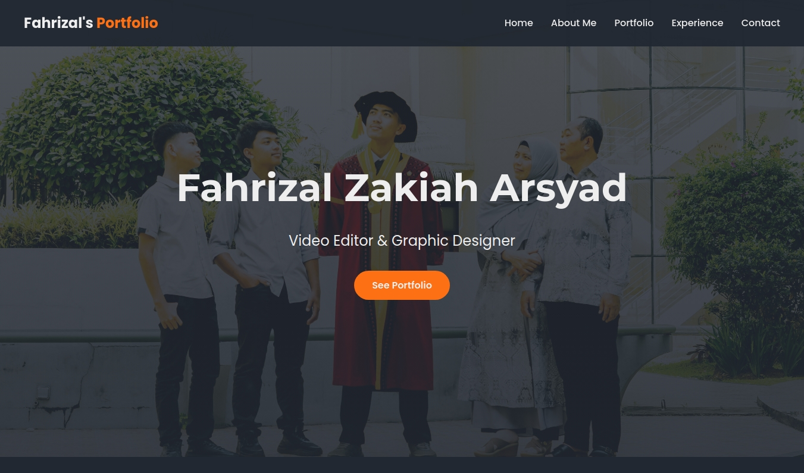

# Website Portofolio

Selamat datang di repositori project saya. Project ini dibangun untuk menampilkan karya dan keahlian anda. Website ini dirancang agar bersih, modern, dan sepenuhnya responsif.

[](https://developer.mozilla.org/en-US/docs/Web/Guide/HTML/HTML5)
[](https://developer.mozilla.org/en-US/docs/Web/CSS)
[](https://developer.mozilla.org/en-US/docs/Web/JavaScript)
[](https://www.php.net/)

## Live Demo

Anda dapat melihat versi langsung dari website ini di sini:
**[https://fahrizalportofolio.my.id](https://fahrizalportofolio.my.id)** 🚀

## Screenshot



## Deskripsi Proyek

Website ini berfungsi sebagai pusat digital untuk menampilkan proyek-proyek yang telah anda kerjakan. Dibangun dengan teknologi web modern, portofolio ini menonjolkan estetika visual yang bersih dan pengalaman pengguna yang mulus di semua perangkat.

## Fitur-Fitur Utama ✨

- **Desain Responsif**: Tampilan yang optimal di semua perangkat, mulai dari desktop, tablet, hingga mobile.
- **Galeri Portofolio Interaktif**:
    - **Filter Kategori**: Pengguna dapat memfilter karya berdasarkan kategori (misal: Live Stream, Graphic Design).
    - **Lightbox Media**: Menampilkan gambar dan video dalam ukuran besar saat diklik, lengkap dengan deskripsi dan link eksternal. Video akan diputar secara otomatis.
- **Navigasi Halaman Mulus**: Efek *smooth scrolling* saat berpindah antar bagian halaman.
- **Header Dinamis**: Header navigasi berubah tampilan saat halaman digulir untuk pengalaman pengguna yang lebih baik.
- **Slider Pengalaman**: Bagian pengalaman kerja ditampilkan dalam bentuk slider interaktif yang dapat digeser.
- **Formulir Kontak Fungsional**: Menggunakan **PHPMailer** dengan otentikasi SMTP untuk memastikan pesan dari pengunjung terkirim dengan andal ke email saya.
- **Tombol Download CV**: Memudahkan perekrut untuk mengunduh CV saya langsung dari halaman "About Me".

## Teknologi yang Digunakan 🛠️

- **Frontend**:
    - HTML5 (Struktur Semantik)
    - CSS3 (Flexbox untuk layout, Animasi, Variabel CSS)
    - JavaScript (ES6) untuk interaktivitas DOM.
- **Backend**:
    - PHP untuk memproses data dari formulir kontak.
- **Library & Dependensi**:
    - **PHPMailer**: Untuk mengirim email dari formulir kontak melalui server SMTP.
    - **Font Awesome**: Untuk ikon-ikon di seluruh website.
    - **Google Fonts**: Untuk tipografi (keluarga font 'Poppins' dan 'Montserrat').

## Instalasi dan Konfigurasi ⚙️

Untuk menjalankan proyek ini di server Anda sendiri, ikuti langkah-langkah berikut:

1.  **Clone Repositori**
    ```bash
    git clone https://github.com/noqia/porto-izal.git
    ```

2.  **Upload ke Web Server**
    Unggah semua file ke direktori `public_html` atau direktori root lain pada web server Anda yang mendukung **PHP**.

3.  **Instalasi PHPMailer (jika folder `vendor` tidak ada)**
    Jika Anda tidak meng-upload folder `vendor`, jalankan perintah berikut di direktori proyek Anda melalui terminal:
    ```bash
    composer require phpmailer/phpmailer
    ```

4.  **Konfigurasi Formulir Kontak**
    Ini adalah langkah paling penting. Buka file `email.php` dan ubah kredensial SMTP sesuai dengan penyedia email Anda (misalnya Zoho Mail atau Gmail).
    ```php
    // Ganti nilai-nilai ini dengan kredensial Anda
    $mail->Host       = 'smtp.zoho.com';                  // Host SMTP
    $mail->Username   = 'emailanda@domainkustom.com';     // Username SMTP (email Anda)
    $mail->Password   = 'kata_sandi_aplikasi_anda';       // Password SMTP (App Password)
    $mail->setFrom('email_pengirim@domain.com', 'Nama Pengirim'); // Email yang akan muncul sebagai pengirim
    $mail->addAddress('email_penerima@domain.com', 'Nama Penerima'); // Email Anda sebagai tujuan
    ```

## Struktur File 📁
/  
├── assets/  
│   ├── css/  
│   │   └── style.css  
│   ├── js/  
│   │   └── main.js  
│   ├── images/  
│   │   └── (file gambar Anda)  
│   └── porto/  
│       └── (file-file portofolio Anda)  
├── vendor/  
│   └── (file-file PHPMailer dari Composer)  
├── email.php  
├── index.html  
└── README.md  

## Kontak & Kredit

- **Pembuat**: Ulqia Nurhusna - [LinkedIn](https://www.linkedin.com/in/ulqianurhusna/) | [Instagram](https://www.instagram.com/noqia/)
